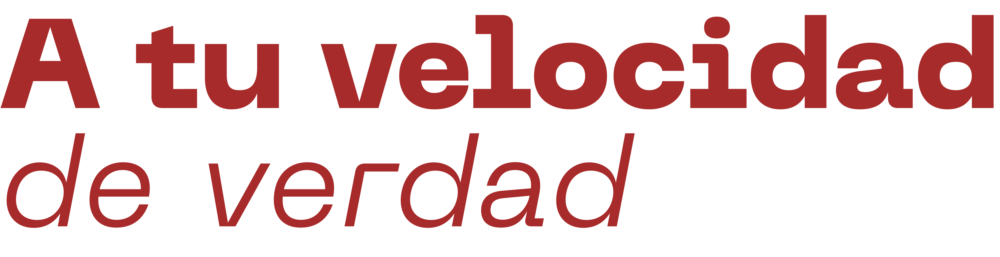

<!DOCTYPE html>
<html lang="es">
<head>
<meta charset="UTF-8">
<meta name="viewport" content="width=device-width, initial-scale=1.0">
<title>Veloz Móvil — Vehículos Nuevos y Usados en Santiago, RD</title>
<meta name="description" content="Compra y financia tu vehículo nuevo o usado en Santiago. Kia, Mazda, Geely, Mitsubishi, Toyota y más. Financiamiento en el lugar, mejores precios.">
<meta name="keywords" content="carros santiago, vehiculos nuevos santiago, kia, mazda, geely, toyota, financiamiento auto, concesionaria santiago rd">
<meta property="og:title" content="Veloz Móvil — Vehículos Nuevos y Usados en Santiago">
<meta property="og:description" content="Financiamiento en el lugar, inventario verificado y la asesoría de un equipo que conoce cada marca que vende.">
<meta property="og:type" content="website">
<meta property="og:locale" content="es_DO">
<meta name="theme-color" content="#14161A">
<link rel="icon" href="isologo.png" type="image/png">
<link rel="preconnect" href="https://fonts.googleapis.com">
<link href="https://fonts.googleapis.com/css2?family=Barlow+Condensed:wght@500;600;700;800&family=Inter:wght@400;500;600&family=JetBrains+Mono:wght@400;500;600&display=swap" rel="stylesheet">

</head>
<body>

  

    

      <a href="tel:+18095801215">&#9742; 809 580-1215</a>
      <a href="tel:+18095833422">809 583-3422</a>
      <a href="tel:+18095833423">809 583-3423</a>
    

    
Ave. Juan Pablo Duarte, No. 200, Santiago, Rep. Dom.

    

    <button class="theme-btn" id="themeToggle" aria-label="Cambiar tema">
      <svg class="moon" viewBox="0 0 24 24"><path d="M12 3a9 9 0 109 9c0-.46-.04-.92-.1-1.36a5.389 5.389 0 01-4.4 2.26 5.403 5.403 0 01-3.14-9.8c-.44-.06-.9-.1-1.36-.1z"/></svg>
      <svg class="sun" viewBox="0 0 24 24"><path d="M12 7a5 5 0 100 10 5 5 0 000-10zM12 1v2M12 21v2M4.22 4.22l1.42 1.42M18.36 18.36l1.42 1.42M1 12h2M21 12h2M4.22 19.78l1.42-1.42M18.36 5.64l1.42-1.42"/></svg>
    </button>
    

      <a href="https://facebook.com/VelozMovil" target="_blank" rel="noopener" aria-label="Facebook">
        <svg viewBox="0 0 24 24"><path d="M24 12.073c0-6.627-5.373-12-12-12s-12 5.373-12 12c0 5.99 4.388 10.954 10.125 11.854v-8.385H7.078v-3.47h3.047V9.43c0-3.007 1.792-4.669 4.533-4.669 1.312 0 2.686.235 2.686.235v2.953H15.83c-1.491 0-1.956.925-1.956 1.874v2.25h3.328l-.532 3.47h-2.796v8.385C19.612 23.027 24 18.062 24 12.073z"/></svg>
      </a>
      <a href="https://instagram.com/velozmovil" target="_blank" rel="noopener" aria-label="Instagram">
        <svg viewBox="0 0 24 24"><path d="M12 2.163c3.204 0 3.584.012 4.85.07 3.252.148 4.771 1.691 4.919 4.919.058 1.265.069 1.645.069 4.849 0 3.205-.012 3.584-.069 4.849-.149 3.225-1.664 4.771-4.919 4.919-1.266.058-1.644.07-4.85.07-3.204 0-3.584-.012-4.849-.07-3.26-.149-4.771-1.699-4.919-4.92-.058-1.265-.07-1.644-.07-4.849 0-3.204.013-3.583.07-4.849.149-3.227 1.664-4.771 4.919-4.919 1.266-.057 1.645-.069 4.849-.069zM12 0C8.741 0 8.333.014 7.053.072 2.695.272.273 2.69.073 7.052.014 8.333 0 8.741 0 12c0 3.259.014 3.668.072 4.948.2 4.358 2.618 6.78 6.98 6.98C8.333 23.986 8.741 24 12 24c3.259 0 3.668-.014 4.948-.072 4.354-.2 6.782-2.618 6.979-6.98.059-1.28.073-1.689.073-4.948 0-3.259-.014-3.667-.072-4.947-.196-4.354-2.617-6.78-6.979-6.98C15.668.014 15.259 0 12 0zm0 5.838a6.162 6.162 0 100 12.324 6.162 6.162 0 000-12.324zM12 16a4 4 0 110-8 4 4 0 010 8zm6.406-11.845a1.44 1.44 0 100 2.881 1.44 1.44 0 000-2.881z"/></svg>
      </a>
      <a href="https://wa.me/18297163438?text=Hola%2C%20quiero%20informaci%C3%B3n%20sobre%20veh%C3%ADculos" target="_blank" rel="noopener" aria-label="WhatsApp">
        <svg viewBox="0 0 24 24"><path d="M17.472 14.382c-.297-.149-1.758-.867-2.03-.967-.273-.099-.471-.148-.67.15-.197.297-.767.966-.94 1.164-.173.199-.347.223-.644.075-.297-.15-1.255-.463-2.39-1.475-.883-.788-1.48-1.761-1.653-2.059-.173-.297-.018-.458.13-.606.134-.133.298-.347.446-.52.149-.174.198-.298.298-.497.099-.198.05-.371-.025-.52-.075-.149-.669-1.612-.916-2.207-.242-.579-.487-.5-.669-.51-.173-.008-.371-.01-.57-.01-.198 0-.52.074-.792.372-.272.297-1.04 1.016-1.04 2.479 0 1.462 1.065 2.875 1.213 3.074.149.198 2.096 3.2 5.077 4.487.709.306 1.262.489 1.694.625.712.227 1.36.195 1.871.118.571-.085 1.758-.719 2.006-1.413.248-.694.248-1.289.173-1.413-.074-.124-.272-.198-.57-.347m-5.421 7.403h-.004a9.87 9.87 0 01-5.031-1.378l-.361-.214-3.741.982.998-3.648-.235-.374a9.86 9.86 0 01-1.51-5.26c.001-5.45 4.436-9.884 9.888-9.884 2.64 0 5.122 1.03 6.988 2.898a9.825 9.825 0 012.893 6.994c-.003 5.45-4.437 9.884-9.885 9.884m8.413-18.297A11.815 11.815 0 0012.05 0C5.495 0 .16 5.335.157 11.892c0 2.096.547 4.142 1.588 5.945L.057 24l6.305-1.654a11.882 11.882 0 005.683 1.448h.005c6.554 0 11.89-5.335 11.893-11.893a11.821 11.821 0 00-3.48-8.413z"/></svg>
      </a>
    

    

  

<header>
  <nav class="wrap">
    
    

      <a href="#inicio">Inicio</a>
      <a href="#inventario">Vehículos</a>
      <a href="#nosotros">Nosotros</a>
      <a href="#contacto">Contacto</a>
    

    <button class="hamburger" id="hamburger" aria-label="Menú">
      
    </button>
    <a href="#contacto" class="nav-cta">Contáctanos</a>
  </nav>
</header>

  <a href="#inicio" class="mobile-link">Inicio</a>
  <a href="#inventario" class="mobile-link">Vehículos</a>
  <a href="#nosotros" class="mobile-link">Nosotros</a>
  <a href="#contacto" class="mobile-link">Contacto</a>

<section class="hero" id="inicio">
  

    

      

        
Santiago, República Dominicana

        <h1>Vehículos nuevos y usados, <em>al instante.</em></h1>
        
Financiamiento en el lugar, inventario verificado y la asesoría de un equipo que conoce cada marca que vende.

      

    

    

    

    

      

      

    

  

</section>

<section class="search" id="searchSection">
  

    <form class="search-box" id="searchForm" onsubmit="return false;">
      

        <label for="filterMarca">Marca</label>
        <select id="filterMarca">
          <option value="">Todas las marcas</option>
        </select>
      

      

        <label for="filterTipo">Tipo</label>
        <select id="filterTipo">
          <option value="">Nuevos y Usados</option>
          <option value="NUEVO">Solo Nuevos</option>
          <option value="USADO">Solo Usados</option>
        </select>
      

      

        <label for="filterMin">Desde año</label>
        <select id="filterMin">
          <option value="">Cualquier año</option>
        </select>
      

      

        <label for="filterMax">Hasta año</label>
        <select id="filterMax">
          <option value="">Cualquier año</option>
        </select>
      

      <button class="search-btn" type="button" id="searchBtn">Buscar</button>
    </form>
  

</section>

<section id="inventario">
  

    

      

        
Inventario

        <h2>Lo último en llegar al lote.</h2>
      

      

        
Todos

        
Nuevos

        
Usados

      

    

    

    

    

  

</section>

<section class="finance">
  

    

      
Calculadora de préstamos

      <h2>Simula tu pago mensual.</h2>
      
Ajusta el monto, la tasa y el plazo para tener una idea de tu cuota antes de visitarnos. Nuestro equipo te ayuda a definir el financiamiento final según tu perfil.

      <ul class="fin-list">
        <li>Respuesta de pre-aprobación en el mismo día</li>
        <li>Convenios con bancos locales</li>
        <li>Plazos flexibles según el vehículo</li>
      </ul>
    

    

      <h3>MONTO Y TÉRMINOS</h3>
      

        <label>Monto RD$ 1,200,000</label>
        <input type="range" id="monto" min="200000" max="4000000" step="10000" value="1200000">
      

      

        <label>Tasa de interés 11.5%</label>
        <input type="range" id="tasa" min="6" max="20" step="0.1" value="11.5">
      

      

        <label>Meses 36</label>
        <input type="range" id="meses" min="12" max="72" step="6" value="36">
      

      

        

          
Pago mensual estimado

          
RD$ 0

        

      

      
* Esta simulación es referencial. La cuota final puede variar según tu perfil crediticio.

    

  

</section>

<section class="about" id="nosotros">
  

    

      
Acerca de nosotros

      <h2 style="font-size:clamp(28px,3vw,38px); font-weight:700; margin-bottom:18px;">Vendemos y financiamos, todo bajo un mismo techo.</h2>
      
Veloz Móvil es una empresa dedicada a la venta y financiamiento de vehículos nuevos y usados, con la mejor calidad y los mejores precios del mercado en Santiago. Contamos con un inventario amplio y variado, y nuestro equipo de asesores está listo para ayudarte a encontrar el vehículo ideal para ti.

      

        
<b id="brandCount">0</b>Marcas disponibles

        
<b>Miembro</b>

        
<b id="vehicleCount">0</b>Vehículos en inventario

      

    

    

      <h3>NUESTRO HORARIO</h3>
      
Lunes a viernes9:00 am – 6:00 pm

      
Sábado9:00 am – 1:00 pm

      
DomingoCerrado

    

  

</section>

<section class="testimonios">
  

    

      

        
Testimonios

        <h2>Lo que dicen nuestros clientes.</h2>
      

    

    

      

        
★★★★★

        
"Excelente atención. Me ayudaron con el financiamiento y en menos de 48 horas tenía mi Kia Seltos. Muy recomendados."

        
Carlos Méndez · Kia Seltos 2027

      

      

        
★★★★★

        
"Compré mi camioneta usada y me dieron un precio justo. El proceso fue transparente y rápido. Volvería sin pensarlo."

        
María Rodríguez · Mitsubishi L200 2025

      

      

        
★★★★★

        
"Primera vez financiando un auto y me explicaron todo paso a paso. Súper profesionales, me siento segura con mi compra."

        
Ana Paula Castillo · Geely Coolray 2026

      

    

  

</section>

<section class="contact" id="contacto">
  

    

      

        
Contáctanos

        <h2>Ven a conocer tu próximo vehículo.</h2>
      

    

    

      

        

          
Dirección

          
Ave. Juan Pablo Duarte, No. 200, Santiago, Rep. Dom.

        

        

          
Teléfono

          

            <a href="tel:+18095801215">(809) 580-1215</a> 
            <a href="tel:+18095833422">(809) 583-3422</a> / <a href="tel:+18095833423">3423</a> 
            Fax: (809) 583-3438
          

        

        

          
WhatsApp

          
<a href="https://wa.me/18297163438" target="_blank" rel="noopener">829-716-3438</a>

        

        

          
Correo

          
<a href="mailto:servicioalcliente@velozmovil.com.do">servicioalcliente@velozmovil.com.do</a>

        

      

      

        <h3>SOLICITA INFORMACIÓN</h3>
        <form id="contactForm">
          

            <label for="formName">Nombre completo</label>
            <input type="text" id="formName" required placeholder="Tu nombre">
          

          

            <label for="formPhone">Teléfono</label>
            <input type="tel" id="formPhone" required placeholder="809-555-5555">
          

          

            <label for="formEmail">Correo electrónico</label>
            <input type="email" id="formEmail" placeholder="tu@correo.com">
          

          

            <label for="formInterest">Vehículo de interés</label>
            <select id="formInterest">
              <option value="">Selecciona un modelo</option>
            </select>
          

          

            <label for="formMsg">Mensaje</label>
            <textarea id="formMsg" placeholder="Cuéntanos qué estás buscando..."></textarea>
          

          <button class="submit-btn" type="submit">Enviar solicitud</button>
          

        </form>
      

    

  

</section>

<footer>
  

    
© 2026 Veloz Móvil S.R.L. Todos los derechos reservados.

    
Desarrollado por <b>Aferros, S.R.L.</b>

    

      <a href="#inventario">Vehículos</a>
      <a href="#nosotros">Nosotros</a>
      <a href="#contacto">Contacto</a>
    

  

</footer>

<a class="whatsapp-float" href="https://wa.me/18297163438?text=Hola%2C%20quiero%20informaci%C3%B3n%20sobre%20veh%C3%ADculos" target="_blank" rel="noopener" aria-label="WhatsApp">
  <svg viewBox="0 0 24 24"><path d="M17.472 14.382c-.297-.149-1.758-.867-2.03-.967-.273-.099-.471-.148-.67.15-.197.297-.767.966-.94 1.164-.173.199-.347.223-.644.075-.297-.15-1.255-.463-2.39-1.475-.883-.788-1.48-1.761-1.653-2.059-.173-.297-.018-.458.13-.606.134-.133.298-.347.446-.52.149-.174.198-.298.298-.497.099-.198.05-.371-.025-.52-.075-.149-.669-1.612-.916-2.207-.242-.579-.487-.5-.669-.51-.173-.008-.371-.01-.57-.01-.198 0-.52.074-.792.372-.272.297-1.04 1.016-1.04 2.479 0 1.462 1.065 2.875 1.213 3.074.149.198 2.096 3.2 5.077 4.487.709.306 1.262.489 1.694.625.712.227 1.36.195 1.871.118.571-.085 1.758-.719 2.006-1.413.248-.694.248-1.289.173-1.413-.074-.124-.272-.198-.57-.347m-5.421 7.403h-.004a9.87 9.87 0 01-5.031-1.378l-.361-.214-3.741.982.998-3.648-.235-.374a9.86 9.86 0 01-1.51-5.26c.001-5.45 4.436-9.884 9.888-9.884 2.64 0 5.122 1.03 6.988 2.898a9.825 9.825 0 012.893 6.994c-.003 5.45-4.437 9.884-9.885 9.884m8.413-18.297A11.815 11.815 0 0012.05 0C5.495 0 .16 5.335.157 11.892c0 2.096.547 4.142 1.588 5.945L.057 24l6.305-1.654a11.882 11.882 0 005.683 1.448h.005c6.554 0 11.89-5.335 11.893-11.893a11.821 11.821 0 00-3.48-8.413z"/></svg>
</a>

<a class="scroll-top" id="scrollTop" href="#" aria-label="Volver arriba">
  <svg viewBox="0 0 24 24"><path d="M7.41 15.41L12 10.83l4.59 4.58L18 14l-6-6-6 6z"/></svg>
</a>

  

    <button class="modal-close" id="modalClose">&times;</button>
    

      

        
        <button class="gallery-nav gallery-prev" id="galleryPrev">&#10094;</button>
        <button class="gallery-nav gallery-next" id="galleryNext">&#10095;</button>
        

      

      

    

    
Cargando imágenes...

    

      

        

          <h2 id="modalTitle"></h2>
          

        

      

      

      

      

      

      

        <a href="#" class="btn-primary" id="modalCta" target="_blank">Cotizar por WhatsApp</a>
        <a href="#contacto" class="btn-outline" id="modalContact">Ir al formulario</a>
      

    

  

</body>
</html>
